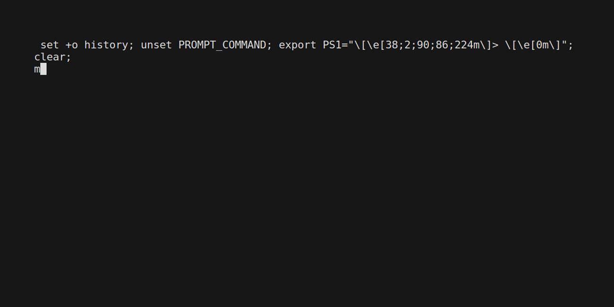
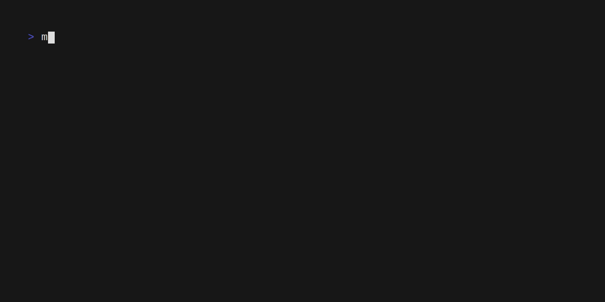

# mracek 

[](https://github.com/mchlumsky/mracek/releases/latest)
[](https://codecov.io/gh/mchlumsky/mracek)
[](/LICENSE.md)
[](https://github.com/mchlumsky/mracek/actions?workflow=build)
[](https://github.com/goreleaser)
[](https://copr.fedorainfracloud.org/coprs/mchlumsky/mracek/package/mracek/)

mracek is a CLI tool to manage your OpenStack [configuration files](https://docs.openstack.org/os-client-config/latest/user/configuration.html#config-files).

mracek is inspired by [kubectx/kubens](https://github.com/ahmetb/kubectx).

## Features

* Create/delete/modify/copy clouds and profiles in your `$HOME/.config/openstack` configuration.
* Switch to a desired openstack cloud simply with `mracek <cloud-name>`.
* mracek supports auto-completion under bash, fish and zsh shells.
* mracek is opinionated about where it puts secrets (passwords, application credential secrets) and always puts them in secrets.yaml
* The directory where the openstack config files are stored is configurable (defaults to `$HOME/.config/openstack/`). See configuration section below.
* By setting the shell variable `OS_CLOUD`, mracek is compatible with [starship](https://starship.rs/).

## Demo



### Smoke tests




## Examples
```shell
# Create a cloud
$ mracek create-cloud --username user1 --password very_secure --verify --auth-url https://cloud1.example.com:5000/v3 --project-name project1 --domain-name domain1 --region-name region1 cloud1

# Show cloud details
$ mracek show-cloud cloud1
---
auth:
    auth_url: https://cloud1.example.com:5000/v3
    username: user1
    password: <masked>
    project_name: project1
    domain_name: domain1
region_name: region1
verify: true

# Create a profile (a profile is a cloud stored in clouds-public.yaml)
$ mracek create-profile --username user1 --password very_secure --verify --auth-url https://cloud1.example.com:5000/v3 --project-name project1 --domain-name domain1 --region-name region1 profile1

# Show profile details
$ mracek show-profile profile1
---
auth:
    auth_url: https://cloud1.example.com:5000/v3
    username: user1
    password: <masked>
    project_name: project1
    domain_name: domain1
region_name: region1
verify: true

# List profiles
$ mracek list-profiles
profile1

# Use a cloud (exports the OS_CLOUD environment variable and launches a sub-shell)
$ mracek cloud1
Switching to cloud cloud1
$ env|grep ^OS_
OS_CLOUD=cloud1

# Delete a cloud
$ mracek delete-cloud cloud1

# Delete a profile
$ mracek delete-profile profile1

# Set cloud details
$ mracek set-cloud  --project-name project1 cloud1

# Set profile details
$ mracek set-profile  --project-name project1 profile1

# Copy cloud while changing the project name
$ mracek copy-cloud --project-name new-project source-cloud destination-cloud

# Smoke tests are basic tests, basically mracek just lists resources from several services (servers for nova, networks for neutron, etc...)
# Run smoke tests against a specific cloud
$ mracek smoke-tests some-cloud

# Run smoke tests against all regions in parallel
$ mracek smoke-tests
```

## Installation

### Fedora

```shell
dnf copr enable mchlumsky/mracek
dnf install mracek
```

### Releases

Download and install a prebuilt release from [here](https://github.com/mchlumsky/mracek/releases)

### From source

Install from source:

```shell
go install github.com/mchlumsky/mracek@latest
```

## Configuration

mracek supports configuration through the configuration file `$HOME/.mracek.yaml` by default and can be changed with the `--config` command line flag.

Example:
```yaml
---
# Can be overridden by environment variable MRACEK_OS_CONFIG_DIR
os-config-dir: /path/to/openstack/config

# Can be overridden by environment variable MRACEK_SHELL
shell: /usr/bin/zsh

# Only export the OS_CLOUD variable when calling `mracek <cloud-name>`
os-cloud-only: true
```

## Acknowledgements

Special thanks to JetBrains for the Open Source development license.